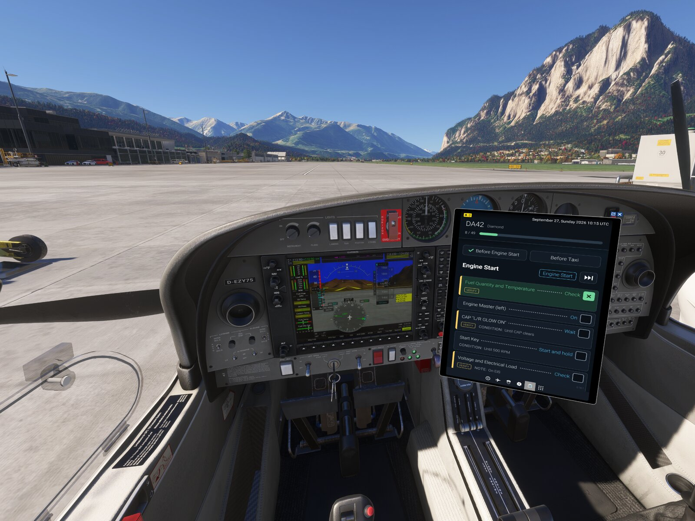
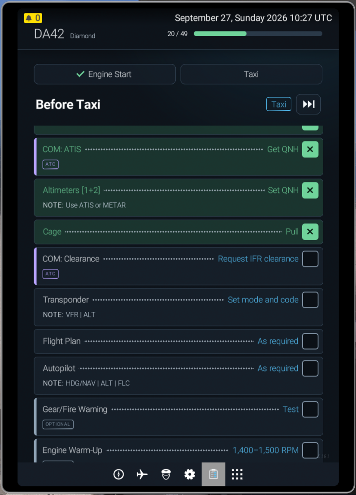
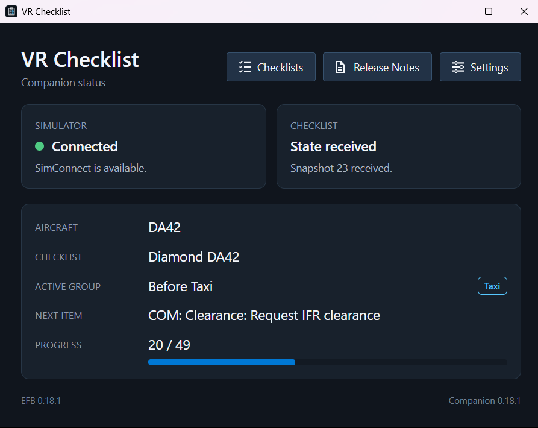
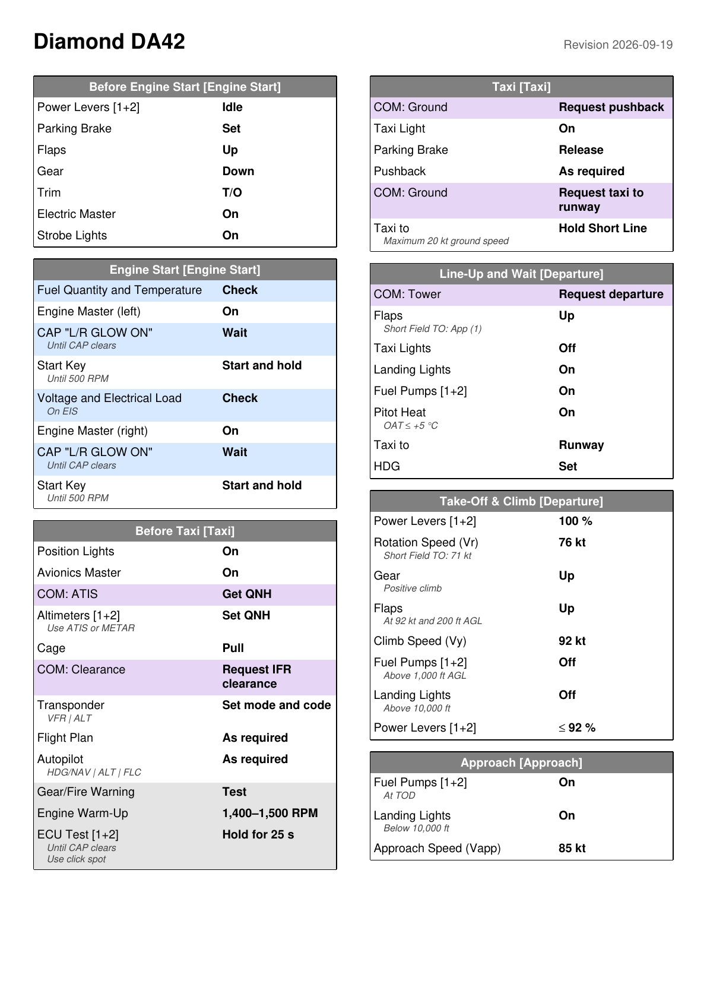

# MSFS 2024 VR Checklist

**Interactive, voice-guided checklists for the EFB tablet in Microsoft Flight
Simulator 2024. Made for VR, just as handy on a monitor.**

In VR, a paper checklist is out of reach and a PDF on a virtual kneeboard is
hard to read. VR Checklist puts a large, clickable checklist into the
Electronic Flight Bag (EFB) of MSFS 2024, opens the right checklist for your
aircraft automatically and, with the companion app, reads every item aloud in
a natural voice, like a first officer calling out the checklist. Your eyes
stay on the switches, not on the tablet.

The checklists are adapted for the game and tuned for fun in the sim rather
than copied from a manual. They recreate complete procedures, so besides
switches and levers they can also include radio calls such as ATIS,
clearance or taxi requests.

Free, open source and offline, apart from an optional update check.

## Highlights

- **Built for VR.** Large text, large rows, large checkboxes: every row is one
  big click target, readable at arm's length in the headset.
- **Hear the checklist.** The companion speaks each item in a pre-recorded
  natural voice instead of robotic text-to-speech, with an optional radio
  effect.
- **Hands on the HOTAS.** Confirm the next item with a key or joystick button
  without reaching for the tablet.
- **The right checklist, automatically.** The app detects your aircraft; no
  manual selection.
- **On a monitor, too.** Works the same in 2D, and your progress survives
  switching between VR and 2D.
- **Print it.** Export any checklist as a printable A4 PDF or copy it as text.

## Features

### Checklists in the EFB

- One group at a time, such as *Before Taxi*, with challenge, response and
  checkbox on one row. Click a row to check it off; click again to reopen it.
- When a group is done, the next one of the same phase opens automatically.
  At the end of a phase, the app waits until you start the next one. Completed
  groups get a green checkmark, and a progress bar shows how far you are.
- Groups belong to flight phases from Engine Start to Shutdown. **Skip phase**
  completes the current phase, for example when you start your flight on the
  runway.
- Item types at a glance:

  | Type     | Shown as                          | Used for                                              |
  |----------|-----------------------------------|-------------------------------------------------------|
  | Action   | plain row                         | operating a switch, lever or setting                  |
  | Verify   | `Verify` label and amber marker   | checking an indication or waiting for a condition     |
  | ATC      | `ATC` label and violet marker     | radio calls such as ATIS, clearance or taxi requests  |
  | Optional | `Optional` label, muted           | tests and extras that do not count toward progress    |

- Conditions and notes, such as *Until CAP clears* or *Maximum 20 kt ground
  speed*, appear directly with the item.
- Pausing and switching between VR and 2D keep your progress; a new flight
  starts fresh.

### Voice callouts

The optional Windows app **VR Checklist Companion** connects to MSFS 2024 and
reads out the next open item as soon as it becomes current.

- Every item is pre-recorded in English with the ElevenLabs voice *Brian*.
- Each group starts with its name, for example "Before Taxi Checklist.".
  "Checklist completed" confirms a finished group, "Engine Start phase
  complete." a finished phase.
- A switchable radio effect makes the callouts sound as if they came over the
  radio.
- Choose any Windows audio output, such as your VR headset or your speakers,
  and try it with a test sound.
- No microphone, no speech recognition, no API key; the voice needs no
  internet connection.

### Companion extras

- See the connection, the active group with its phase and the progress at a
  glance.
- Browse all included checklists before the flight, copy one as text or save
  it as a printable two-column A4 PDF with color-coded item types.
- Read the release notes offline.
- Install per user without administrator rights; .NET and SimConnect are
  included.
- Update the companion with one click after an optional check for new
  versions.

## Included checklists

| Aircraft               | Aircraft package        | Coverage                                             |
|------------------------|-------------------------|------------------------------------------------------|
| Airbus A400M           | Microsoft/iniBuilds     | Full flight, from Electrical Power Up to Securing    |
| Airbus H125            | MSFS default            | Before Start, Engine Start, Before Taxi, Shutdown    |
| Beechcraft Bonanza G36 | MSFS default            | Departure and approach: speeds, flaps and gear       |
| Cessna 152             | MSFS default            | Departure, Climb, Approach, Landing                  |
| Diamond DA42           | COWS (Orbx/Marketplace) | Before Engine Start to Approach, including ATC       |
| Hughes OH-6A / 500C    | Taog's Hangar           | Before Start, Engine Start, Before Takeoff, Shutdown |
| Sikorsky MH-60         | Miltech Simulations     | Preparations, APU and engine start                   |

Scope and coverage differ by aircraft, and more checklists follow with
updates. Missing your aircraft? [Report it](#feedback-and-contributing).

The checklists are memory aids for the **game**, edited with AI assistance,
not flight documents for real-world aviation. Their
[sources and limitations](checklists/data/README.md#content-provenance) are
documented.

## Installation

You need Microsoft Flight Simulator 2024 on a Windows PC. Download both files
of the [latest release](https://github.com/PatUlm/msfs2024-vr-checklist/releases/latest).
Always update the EFB app and the companion together; otherwise the
announcements stay silent.

1. **EFB app:** Extract `patulm-vr-checklist-X.Y.Z.zip` into the MSFS 2024
   Community folder so that it contains the folder `patulm-vr-checklist`.
   Delete the old folder before an update.
2. **Companion (optional):** Run `VRChecklist.Companion-win-Setup.exe`. It
   installs without administrator rights to
   `%LOCALAPPDATA%\VRChecklist.Companion` and creates shortcuts on the desktop
   and in the Start menu. Neither .NET, the MSFS SDK nor a separate
   `SimConnect.dll` is required. The setup is not signed; at the SmartScreen
   warning, choose **More info** and then **Run anyway**. Uninstall it from the
   Windows apps list; settings are kept. Later companion versions can be
   installed from the companion itself; the EFB app is always updated with
   the ZIP.

After installation, open **VR Checklist** in the EFB. The app works without a
running companion. For announcements and to configure confirmation actions,
also start **VR Checklist Companion**. For problems, see
[Companion: launch and diagnostics](companion/README.md#launch-and-diagnostics).

## Usage

Clicking a row checks it off or reopens it. Once all items of a group are
done, the next group of the same phase follows automatically. Optional items
do not count toward the progress bar, but they hold the automatic group change
until they are done or you page on manually.

At the end of a phase, the completed group stays on screen and the button to
the next group is highlighted. Click it, or press the confirmation key, when
you are ready for the next phase.

`Skip phase` completes the contiguous current phase block, including optional
items, and stays at its end like a completed phase.

For a key or HOTAS, bind the action **SET PLASMA OFF** in the MSFS
**Controls** (event `PLASMA_OFF`; the display name may differ by simulator
language). It confirms the next open item of the displayed group while the app
is open in the EFB; at the end of a completed phase, it opens the next phase.
The event is passed on to the simulator; side effects in other aircraft cannot
be ruled out. The reasons for this event are given in
[ADR 0011](docs/adr/0011-confirmation-actions-in-the-companion.md).

In the companion under **Settings**:

- **EFB Keybindings**: the switch enables confirmation; the dropdown next to it
  selects the MSFS action, currently `SET PLASMA OFF`. On by default. When off,
  the selection is kept. Editable without the simulator: the companion stores
  the selection locally and transfers it as soon as VR Checklist is reachable
  in the EFB. Notices about a pending transfer disappear once the EFB has
  applied it. The EFB keeps the last applied value without the companion,
  across flight changes and simulator restarts. Off only stops checklist
  confirmation; the event still reaches the aircraft.
- `Read checklist items`: reads the next open item aloud; on by default.
- `Radio effect`: switches the sound filter on or off live; on by default.
- `Audio output` and `Test sound`: select and test the output device. An
  unavailable device stays selected until it returns or is replaced.
- `Updates`: checks GitHub Releases once per start for a new companion
  version. Off until you allow it when first asked; the check sends only the
  usual web requests to GitHub. An offered update is installed only when you
  click `Install update`; the companion then restarts and reminds you to
  replace the EFB app with the ZIP from the release page.

Group completion and the test sound also work with item announcements turned
off. Minimizing keeps the connection and audio running; closing exits the
companion.

## Feedback and contributing

If an aircraft has no checklist, report the diagnostic values `ATC MODEL`,
`ATC TYPE` and `TITLE`; the companion copies them with `Copy`. For other bugs,
the version, aircraft, steps to reproduce and, if useful, a screenshot help.

- [Development](docs/development.md): setup, tests and simulator iteration.
- [Checklist data](checklists/data/README.md): add or correct content.
- [Roadmap](ROADMAP.md) and [backlog](BACKLOG.md): next goal and upcoming work.
- [Changelog](CHANGELOG.md): changes per version.
- [Third-party licenses](docs/third-party-licenses.md): components and primary
  sources.

## License

The project's own code and content are licensed under the
[MIT License](LICENSE). Excluded are the configuration files taken from the
MSFS SDK EFB template ([origin](msfs/PackageSources/README.md)), the
[third-party components](docs/third-party-licenses.md), the
[in-game screenshots](docs/assets/README.md) and the voice recordings, which
have their own [audio terms](assets/audio/LICENSE): redistribution and
modification are allowed, while AI training and the other limits of the
ElevenLabs usage policy still apply.

Microsoft Flight Simulator 2024 © Microsoft Corporation. MSFS 2024 VR
Checklist was created under Microsoft's
"[Game Content Usage Rules](https://www.xbox.com/en-US/developers/rules)"
using assets from Microsoft Flight Simulator 2024, and it is not endorsed by
or affiliated with Microsoft. Aircraft names are trademarks of their
respective owners.
